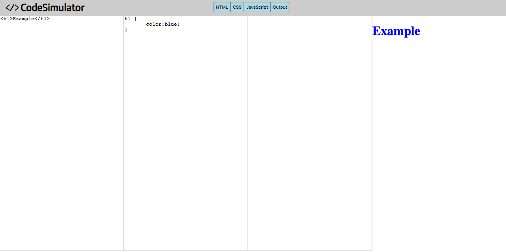

CodeSimulator v0.1
=======

## Built with Javascript and JQuery.

A code simulator that displays the output
of HTML, CSS and Javascript code.

The output is an iframe that render the imput code.

**First JQuery project**, `monospace`.

---

A [link](https://www.manuel-barbiero.com/projects/code-simulator).

